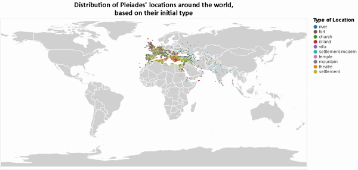

{(aim|}
This visualization shows the distribution of pleiades' locations based on their initial structure type around **Mediterranean Sea**, through the years. In this visualization you can also see the middle year, lifetime but also the last known structure type of the location.
{|aim)}

{(vistype|}
For these visualizations we used **maps**
{|vistype)}

# Data Preparation

```python
import altair as alt
from vega_datasets import data
import pandas as pd
import numpy as np
from altair import datum

#Load the dataset
locations = pd.read_csv('pleiades-locations.csv')

alt.data_transformers.disable_max_rows()
pd.options.mode.chained_assignment = None

#Extract only the columns that we will use
locations = locations[['maxDate','minDate','reprLat','reprLong','featureType']]

#Remove rows with missing data and fix them properly
locations['featureType'] = locations['featureType'].str.replace('-2','')
locations = locations[locations.featureType != 'unknown']
locations = locations[locations.featureType != 'unknown,']
locations = locations[locations.featureType != '']
locations.dropna(subset=['maxDate','minDate','reprLat','reprLong','featureType'],inplace=True)

#Remove locations before archaic period based on the dataset description
locations= locations[~(locations['minDate'] < -1000)]

#Sequence of actions to split featureType column to two columns, 
#the initial and last type of a location

type_index = [locations.maxDate,locations.minDate,locations.reprLat,locations.reprLong]
type_df = pd.DataFrame(locations.featureType.str.split(',').tolist(),index=type_index)

#Reformat column indexes
type_df.reset_index(inplace=True)
type_df.columns = ['maxDate','minDate','reprLat','reprLong','type0','type1','type2','type3','type4']

#Create a numpy array from the dataframe(general bad practise but here is uselful)
arr = np.array(type_df,dtype=str)
for i in range(arr.shape[0]):
    if arr[i][5] in ["","None","nan"]:
        arr[i][5] = arr[i][4]
        continue
    for j in range(6,9):
        if arr[i][j] not in ["","None","nan"]:
            arr[i][5] = arr[i][j]

#Create a new dataframe and keep only the first two types that now
#have the first and last type of each location
final_df = pd.DataFrame(arr)
final_df.columns = ['maxDate','minDate','reprLat','reprLong','initialType','lastType','','','']
final_df = final_df[['maxDate','minDate','reprLat','reprLong','initialType','lastType']]
final_df = final_df.apply(pd.to_numeric, errors='ignore')
final_df = final_df[~(final_df['reprLat'] < -90)]
final_df = final_df[~(final_df['reprLat'] > 90)]

#Find the 10 types that occur more often in the dataset
top_10 = final_df['initialType'].value_counts().keys()[0:10]

#Filter the dataset based on the top 10 types
top10_df = final_df[final_df['initialType'].isin(top_10)]
top10_df = top10_df[top10_df['lastType'].isin(top_10)]
top10_df['averageYear'] = (top10_df['minDate'] + top10_df['maxDate']) /2
```


```python
#world map from vega_datasets
world_map = alt.topo_feature(data.world_110m.url, 'countries')

#legend selection for types
selection = alt.selection_multi(fields=['initialType'], bind='legend')

#color based on vega color schema 'category10'
dmn=['river', 'fort', 'church', 'island', 'villa', 'settlement-modern','temple', 'mountain', 'theatre', 'settlement']
rng=['#1F77B4','#8C564B','#2CA02C','#D62728','#9467BD','#17BECF','#E377C2','#7F7F7F','#FF7F0E','#BCBD22']
color = alt.Color('initialType:N',scale=alt.Scale(domain=dmn,range=rng),title="Type of Location")

#world map background from topojson data
background = alt.Chart(world_map).mark_geoshape(
    fill='lightgray',
    stroke='white'
).properties(
    width=850, height=425
)

#point for each location of the dataset colored with its type
points = alt.Chart(top10_df).mark_circle(size=3).encode(
    longitude='reprLong:Q',
    latitude='reprLat:Q',
    color=color,
    opacity=alt.condition(selection, alt.OpacityValue(1), alt.OpacityValue(0))
).add_selection(
    selection)

#Create a layer chart from the topojson world map and points of locations
final_map=alt.layer(background,points).properties(
    title=["Distribution of Pleiades' locations around the world,","based on their initial type"]
).configure_legend(
    titleFont='Arial',
    titleFontSize=14,
    labelFont='Arial',
    labelFontSize = 12
).configure_title(
    fontSize=20,
    font='Calibri',
    anchor='middle',
    color='black').project(
    type= 'equirectangular'
)

final_map
```



## Distribution around Mediterranean Sea

In the visualization below we can see the distribution of locations through the years but also we can select a specific structure to see its distribution. The most interesting aspects of this visualization is that most of the locations are around Italy and Greece showing a high activity through roman and hellinistic years. A line of **fonts** in the middle of Europe is another interesting aspect of this visualization. 

```python
#world map from vega_datasets
world_map = alt.topo_feature(data.world_110m.url, 'countries')

#legend selection for types
selection = alt.selection_multi(fields=['initialType'], bind='legend')

#color based on vega color schema 'category10'
dmn=['river', 'fort', 'church', 'island', 'villa', 'settlement-modern','temple', 'mountain', 'theatre', 'settlement']
rng=['#1F77B4','#8C564B','#2CA02C','#D62728','#9467BD','#17BECF','#E377C2','#7F7F7F','#FF7F0E','#BCBD22']
color = alt.Color('initialType:N',scale=alt.Scale(domain=dmn,range=rng),title="Type of Location")

#calculate min and max to be used as bound in sliders
minDate = top10_df['minDate'].min()
maxDate = top10_df['maxDate'].max()

#create minimum and maximum sliders for the chart
min_slider = alt.binding_range(min=minDate, max=maxDate, step = 1)
max_slider = alt.binding_range(min=minDate, max=maxDate, step = 1)

min_select = alt.selection_single(bind=min_slider, fields=['min_bound'], name="from",init={'min_bound':minDate})
max_select = alt.selection_single(bind=max_slider, fields=['max_bound'], name="to",init={'max_bound':maxDate})

#world map background from topojson data 
background = alt.Chart(world_map).mark_geoshape(
    fill='lightgrey',
    stroke='white'
).properties(
    width=800, height=600
)
points = alt.Chart(top10_df).mark_circle(size=10).encode(
    longitude='reprLong:Q',
    latitude='reprLat:Q',
    color=color,
    opacity=alt.condition(selection, alt.OpacityValue(1), alt.OpacityValue(0)),
    tooltip=[alt.Tooltip('averageYear',title="Middle year"),
             alt.Tooltip('lastType',title="Last known type"),
             alt.Tooltip('lifetime:Q',title="Lifetime(years)")]
).add_selection(
    selection,
    max_select,
    min_select
).transform_calculate(
    lifetime= 'datum.maxDate - datum.minDate'
).transform_filter(
    #filter to display locations that was known inside year range specified by sliders
    ((alt.datum.minDate >= min_select.min_bound) & (alt.datum.minDate <= max_select.max_bound)) |
    ((alt.datum.maxDate >= min_select.min_bound) & (alt.datum.maxDate <= max_select.max_bound)))

#Create a layer chart from the topojson world map and points of locations
final_map=alt.layer(background,points).properties(
    title="Distribution of Pleiades' locations in Mediterranean Sea through the years"
).configure_legend(
    titleFont='Arial',
    titleFontSize=14,
    labelFont='Arial',
    labelFontSize = 12
).configure_title(
    fontSize=20,
    font='Calibri',
    anchor='middle',
    color='black'
).project(
    type= 'equirectangular',
    scale= 650,                        
    center= [25,40],
    clipExtent= [[0, 0], [800, 600]],)

final_map

```


{(vismapping|}

 |             |World Map            |Mediterranean Sea Map                |
 |:-----------:|:-------------------:|:-----------------------------------:|
 |**longitude**|longitude of location|longitude of location                |
 |**latitude** |latitude of location |latitude of location                 |
 |**color**    |initial location type|initial location type                |
 |**tootip1**  |N/A                  |middle year((minDate+maxDate)/2)     |
 |**tootip2**  |N/A                  |last known location type             |
 |**tootip3**  |N/A                  |lifetime of location(maxDate-minDate)|

{|vismapping)}

{(dataprep|}
I firstly extract from the dataset only the columns that I will use. Using `minDate` and `maxDate` I create another column with the `averageYear` of the location. The extracted data are also filtered with only the top 10 `featureType`. Another column is created inside `transform_calculate` again with the use of `minDate` and `maxDate` to find the `lifetime` of a location.
{|dataprep)}

{(limitations|}
One limitation of this visualization is the fact that the map is not scalable, therefore cannot zoom or navigate through the map. Adding such a feature would lead to more interesting results. Also the fact that the last known type is used as a tooltip is not optimal. Changing the type of the location through the years would lead to more accurate visualizations.
{|limitations)}
