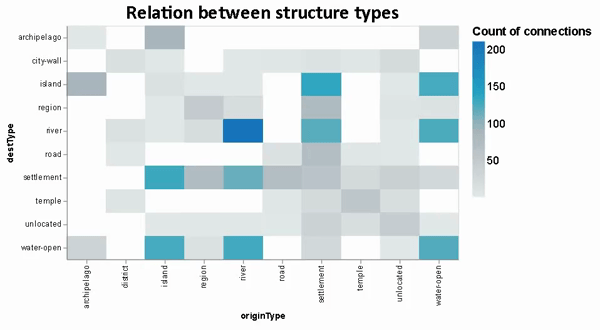

{(aim|}
This visualization shows the relation between top 10 types of places based on their connectivity.
{|aim)}

{(vistype|}
For these visualizations we used **heatmap**
{|vistype)}

# Data Preparation

```python
import altair as alt
from vega_datasets import data
import pandas as pd
import numpy as np

places = pd.read_csv('pleiades-places.csv')

alt.data_transformers.disable_max_rows()

#Choose only the columns we need and remove missing or wrong inputs
places = places[['reprLong','reprLat','connectsWith','hasConnectionsWith','featureTypes','path']]
places.dropna(subset=['reprLong','reprLat','connectsWith','hasConnectionsWith','featureTypes','path'],inplace=True)
places['path'] = places['path'].str.replace('/places/','')
places['initialType'] = places['featureTypes'].str.split(',').str[0]
places['initialType'] = places['initialType'].str.replace('-2','')
places = places[places.featureTypes != 'unknown']
places = places[places.featureTypes != 'unknown,']
places.drop(columns=['featureTypes'],inplace=True)
places['connectsWith'] = places['connectsWith'].str.replace(' ','')
places['hasConnectionsWith'] = places['hasConnectionsWith'].str.replace(' ','')
places.reset_index(inplace=True)
places.drop(columns=['index'],inplace=True)
places.drop_duplicates(subset=['reprLong', 'reprLat'], inplace=True)

#Create a numpy array from the dataframe(general bad practise but here is uselful)
#From the numpy array we create a list of connections between the places
arr = np.array(places,dtype=str)
con_list = []
for i in range(arr.shape[0]):
    connections = arr[i][2].split(',')
    x = arr[i][3].split(',')
    for con in x:
        connections.append(con)
    for con in connections:
        for k in range(arr.shape[0]):
            if con == arr[k][4]:
                con_list.append([arr[i][4],arr[k][4],arr[i][5],arr[k][5]])
                break

#convert the connection list into dataframe
connections = pd.DataFrame(con_list)
connections.columns=['origin','destination','originType','destType']
connections.sort_values(by=['origin'],inplace=True)
connections.reset_index(inplace=True)
connections.drop(columns=['index'],inplace=True)

#Find the 10 types that occur more often in the dataset
top10_org = connections['originType'].value_counts().keys()[0:10]

top10_des = connections['destType'].value_counts().keys()[0:10]

#Filter the dataset based on the top 10 types
final = connections[connections['originType'].isin(top10_org)]
final = final[final['destType'].isin(top10_des)]
```
## Relation between connections of structure types

In the below visualization we can see which of structure types are strongly related to each other based on the connections of places. Except the "obvious" relation between `river` we can see the places that are strongly connected are `open-water`, `river`, `settelment` and `island`.

```python
alt.Chart(final).mark_rect().encode(
    x='originType:N',
    y='destType:N',
    color=alt.Color('sum_all:Q', scale=alt.Scale(scheme="lightgreyteal"),title="Count of connections"),
    tooltip=[alt.Tooltip('sum_all:Q',title="Count of connections")]
).transform_joinaggregate(
    suma = 'count()',
    groupby=['originType','destType']
).transform_joinaggregate(
    suma1 = 'count()',
    groupby=['destType','originType']
).transform_calculate(sum_all='datum.suma+datum.suma1').properties(
    title="Relation between structure types",
    width=500,
    height=300
).configure_title(
    fontSize=25,
    font='Calibri',
    anchor='middle',
    color='black'
).configure_legend(
    titleFont='Arial',
    titleFontSize=15,
    labelFont='Arial',
    labelFontSize = 14
)
```



{(vismapping|}

 |           |Relation between types            |
 |:---------:|:--------------------------------:|
 |**x**      |origin **type** of connection     |
 |**y**      |destination **type** of connection|
 |**color**  |aggregate number of connections   |
 |**tootip** |aggregate number of connections   |

{|vismapping)}

{(dataprep|}
I firstly extract from the dataset only the columns that I will use. Using a `connectsWith` and `hasConnectionsWith` I created a new dataframe containing all those connections between distinct places in separate rows with its `originType` and `destType` corresponding to type of each place respectively. Grouping by `destType` and `originType` in `connections` dataframe we count the **number of connections** that each combination of connection has.
{|dataprep)}

{(limitations|}
Beside the fact that this visualization shows the relations of structure types based on the connections of places, a hirerachical approach would lead to more clear results because these connections indicate some inheritance. (eg. `river` to `water-open`)
{|limitations)}