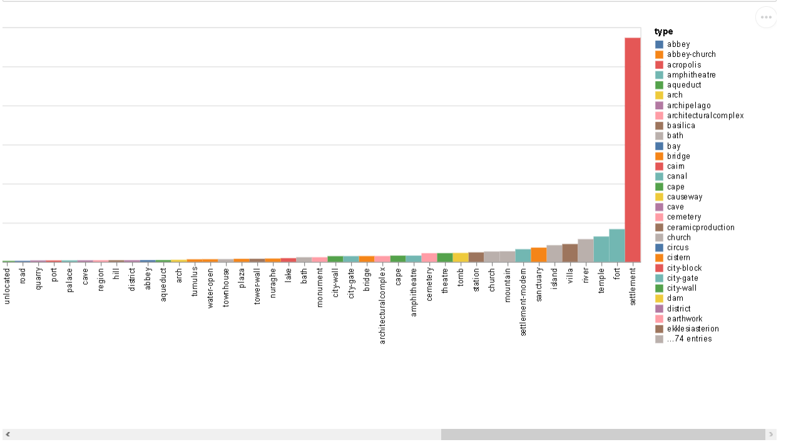
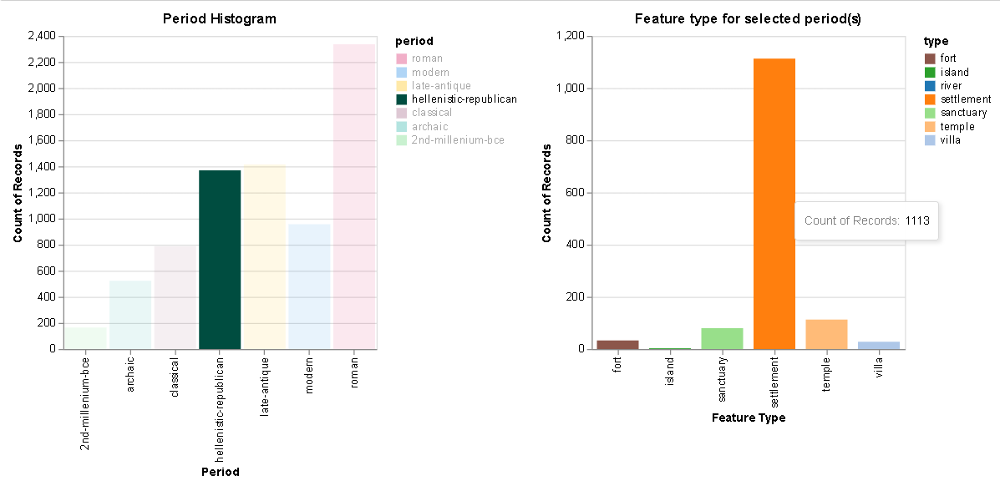

---
elm:
  dependencies:
    gicentre/elm-vegalite: latest

narrative-schemas:
  - coursework
---

Author: Perikleous Michalis (985936)

{(aim|}
This chart shows the count of locations of **top seven** `period` that occur much more frequently in the dataset. It also shows the count of locations of **top seven** `type` of locations the occur much more frequently in the dataset, for each of these `period`.
{|aim)}

{(vistype|}
For these visualizations we used **bar charts**(histograms)
{|vistype)}

# Data Preparation

```python
import altair as alt
import vega_datasets as data
import pandas as pd
import numpy as np

locations = pd.read_csv('pleiades-locations.csv')

alt.data_transformers.disable_max_rows()
#Data preparation: Match each period with the type based on order they are inserted

#Remove locations that with missing information, either from timePeriodsKeys or featureType
locations['timePeriodsKeys'] = locations['timePeriodsKeys'].str.replace(' ','')
locations['featureType'] = locations['featureType'].str.replace('-2','')
locations.dropna(subset=['timePeriodsKeys'],inplace=True)
locations = locations[locations.featureType != 'unknown']
locations = locations[locations.featureType != 'unknown,']

#Split timePeriodsKeys column to several columns separating the periods, 
#and keep the first 4 periods of the location
periodIndex = [locations.id,locations.featureType]
period_df = pd.DataFrame(pd.DataFrame(locations.timePeriodsKeys.str.split(',').tolist(), 
                                          index=periodIndex)).dropna(thresh=800,axis='columns')
#Reformat column indexes
period_df.reset_index(inplace=True)
period_df.columns = ['id', 'featureType','period1','period2','period3','period4']

#Further removing of missing information
period_df = period_df[period_df.featureType != '']
period_df = period_df.dropna(subset=['featureType'])

#Split featureType column to several columns separating type,
#and keep first 4 types of the location
period_feature_index = [period_df.id,period_df.period1,period_df.period2,
                        period_df.period3,period_df.period4]
period_feature_df = pd.DataFrame(pd.DataFrame(period_df.featureType.str.split(',').tolist(), 
                                              index=period_feature_index).dropna(thresh=10,axis='columns'))
#Reformat column indexes
period_feature_df.reset_index(inplace=True)
period_feature_df.columns = ['id','period1','period2','period3','period4',
                             'type1','type2','type3','type4']

#Create a numpy array from the dataframe(general bad practise but here is uselful)
arr = np.array(period_feature_df,dtype=str)
for i in range(arr.shape[0]):
    for j in range(5,9):
        if arr[i][j] in ["","None","nan"]:
            arr[i][j] = "nan"
            for k in range(j,9):
                if(arr[i][k-4] != "nan"):
                    arr[i][k] = arr[i][j-1]

#Create array list to create combination of period and type columns
arr_list = []
for i in range(arr.shape[0]):
    for j in range(1,5):
        if arr[i][j] != "nan":
            arr_list.append([arr[i][0],arr[i][j],arr[i][j+4]])

#Create new dataframe from our array with correct split of period and type for each period
#(based on comma seperate ordering)
final_df = pd.DataFrame(arr_list)
final_df.columns = ['id','period','type']

#Find the 7 periods that occur more often in the dataset
top7Periods = final_df['period'].value_counts().keys()[0:7]

#Find the 7 types that occur more often in the dataset
top7Types = final_df['type'].value_counts().keys()[0:7]

#Filter the dataset based on the top 7 periods and types
top7_df = final_df[final_df['period'].isin(top7Periods)]
top7_df = top7_df[top7_df['type'].isin(top7Types)]
```
## Use of all periods and types

In the following bar charts we created two histograms. The first one using all distinct `period` values we have in the dataset, and the second one using all distinct `type` values from the dataset. To produce our visualizations we used `final_df` dataframe that is the dataset after data preprocessing phase.

```python
#All periods histogram
period_hist = alt.Chart(final_df).mark_bar(size=20).encode(
    x = alt.X("period:N",title='Period',sort ='y'),
    y = alt.Y('count(period):Q'),
    color='period:N',
    tooltip=['count()']
).properties(
    title="Period Histogram")
period_hist
```


```python
#All types histogram
type_hist = alt.Chart(final_df).mark_bar(size=20).encode(
    x = alt.X('type:N',title='Feature Type',sort ='y'),
    y = alt.Y('count(type):Q'),
    color=alt.Color('type:N'),
    tooltip=['count()']
).properties(
    title="Feature type for selected period(s)"
)
type_hist
```



## Use of top seven categories

To produce our visualizations we used `top7_df` dataframe that is the dataset that contains only the top seven `period` and `type`.

```python
selection = alt.selection_multi(fields=['period'], bind='legend')

#period histogram
period_hist = alt.Chart(top7_df).mark_bar(size=40).encode(
    x = alt.X("period:N",title='Period'),
    y = alt.Y('count(period):Q'),
    color=alt.Color('period:N',scale=alt.Scale(
        domain=['roman', 'modern', 'late-antique', 'hellenistic-republican','classical', 'archaic', '2nd-millenium-bce'],
        range=['#D81B60', '#1E88E5' ,'#FFC107', '#004D40', '#A06184', '#24B2A6', '#65D877'])),
    opacity=alt.condition(selection, alt.OpacityValue(1), alt.OpacityValue(0.1)),
    tooltip=['count()']
).properties(
    title="Period Histogram",
    width=300).add_selection(
selection)

#type histogram
type_hist = alt.Chart(top7_df).mark_bar(size=40).encode(
    x = alt.X('type:N',title='Feature Type'),
    y = alt.Y('count(type):Q'),
    color=alt.Color('type:N', scale=alt.Scale(
        domain=['fort', 'island', 'river', 'settlement','sanctuary', 'temple', 'villa'],
        range=['#8c564b', '#2ca02c' ,'#1f77b4', '#ff7f0e', '#98df8a', '#ffbb78', '#aec7e8'])),
    tooltip=['count()']
).properties(
    title="Feature type for selected period(s)",
    width=300,
).transform_filter(
selection).interactive()

alt.hconcat(period_hist, type_hist).resolve_scale(
    color='independent'
)
```




{(vismapping|}

|          |All Periods Chart |All Types Chart   |Top Seven First   |Top Seven Second  |
|:--------:|:----------------:|:----------------:|:----------------:|:----------------:|
|**x**     |period categories |type categories   |period categories |type categories   |
|**y**     |count of locations|count of locations|count of locations|count of locations|
|**color** |period categories |type categories   |period categories |type categories   |
|**tootip**|count of locations|count of locations|count of locations|count of locations|

{|vismapping)}

{(dataprep|}
Firstly we remove all rows with missing information in either of **timePeriodsKeys** and **featureType** columns. Afterwards we split the columns by the comma delimeter creating new rows for each of these period or feature type respectively. With all these new but also existed rows we create a new dataframe with **period** and **type** columns. Further selection took place to filter top seven periods and top seven types based on the occurance of the locations. In general the preprocessing was done to deal with the above two columns that have comma separated values. For the final visualizations we aggregate periods and types by category to count locations.
{|dataprep)}

{(limitations|}
One location can map to many types and periods. With the above charts we are not showing this relation between a location, periods and types. Someone can assume that the sum of count of locations of each period results to a number of distinct locations which is not the case. Additional bar charts to show how many locations occurs more that once would minimize this confusion.
{|limitations)}
