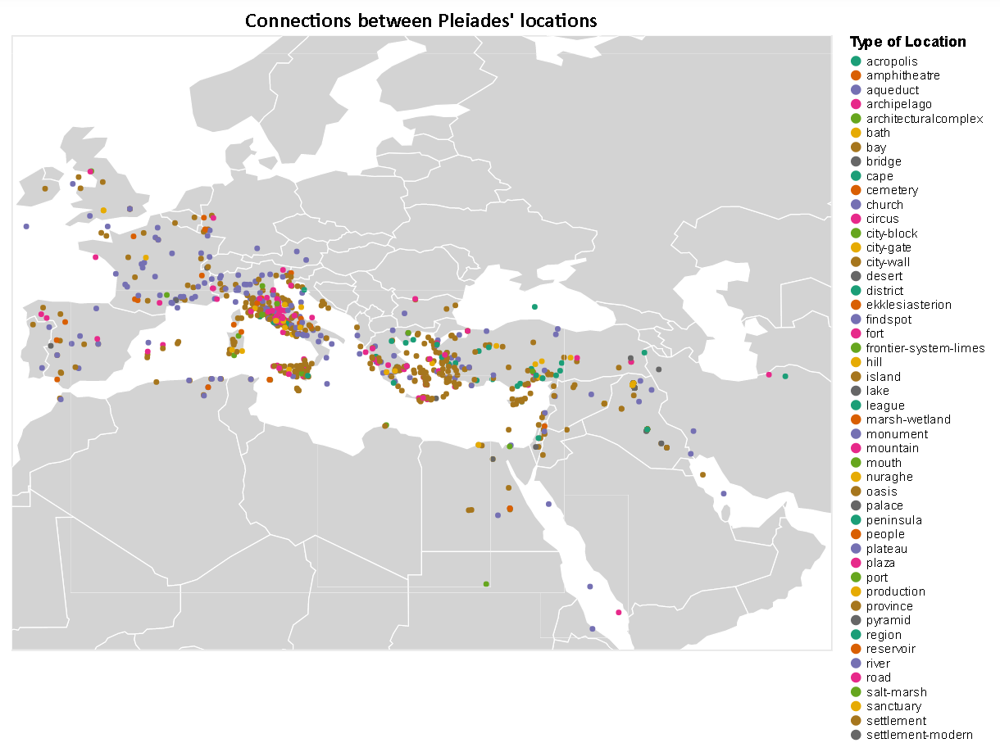
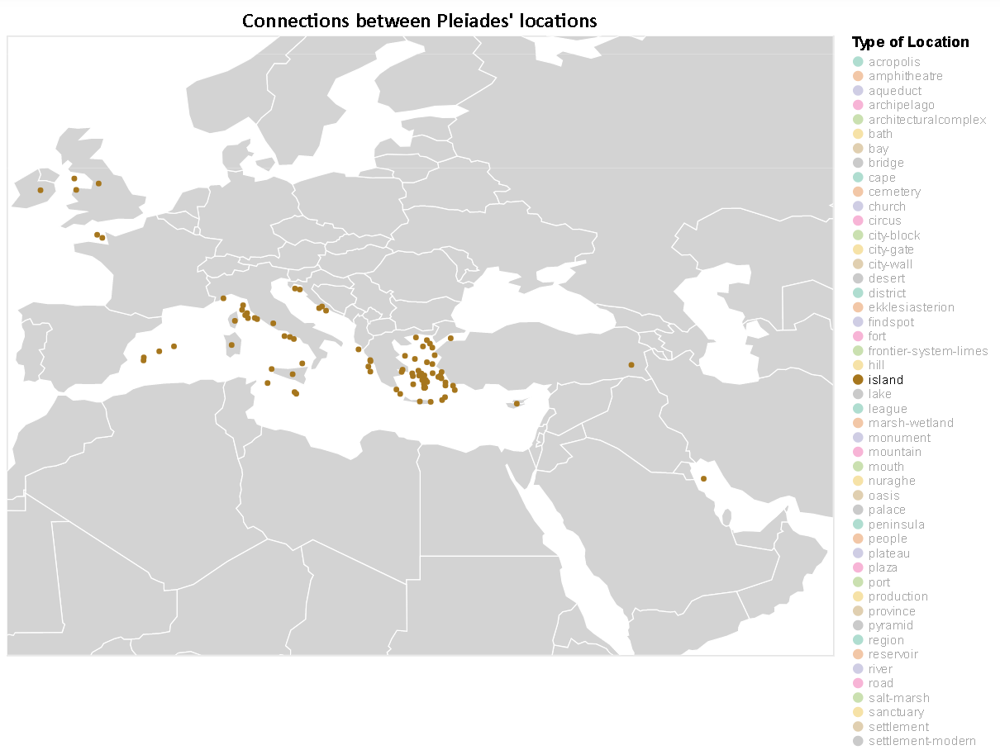
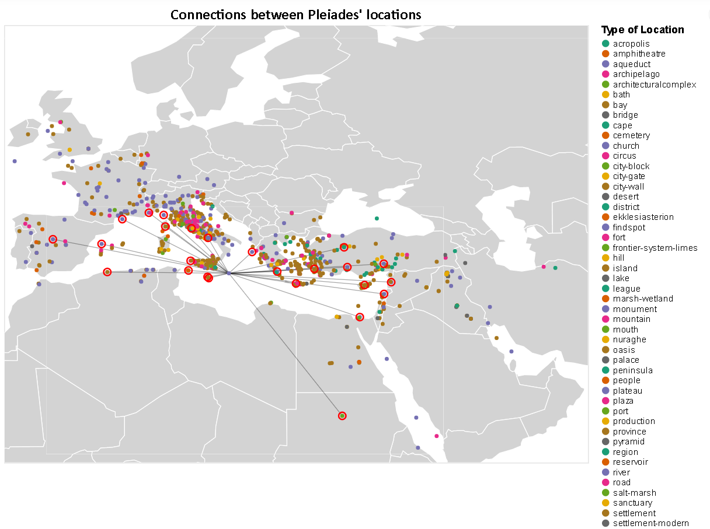
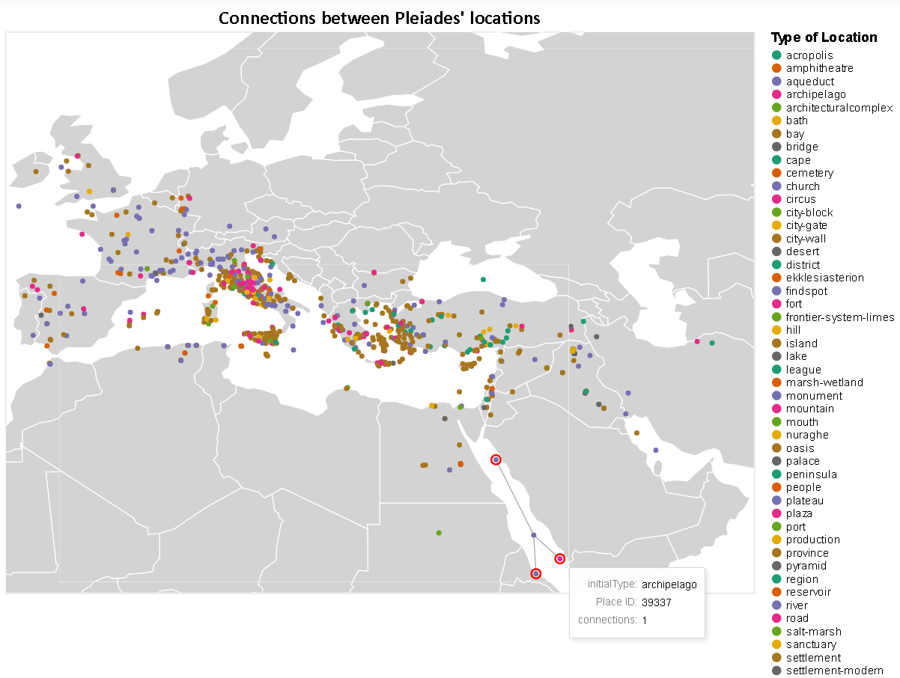

{(aim|}
This visualization shows the **connections** between pleiades' places around Mediterranean Sea. It can also focus on a specific structure and find its relationships
{|aim)}

{(vistype|}
For these visualizations we used **maps**
{|vistype)}

# Data Preparation

```python
import altair as alt
from vega_datasets import data
import pandas as pd
import numpy as np

places = pd.read_csv('pleiades-places.csv')

alt.data_transformers.disable_max_rows()

#Choose only the columns we need and remove missing or wrong inputs
places = places[['reprLong','reprLat','connectsWith','hasConnectionsWith','featureTypes','path']]
places.dropna(subset=['reprLong','reprLat','connectsWith','hasConnectionsWith','featureTypes','path'],inplace=True)
places['path'] = places['path'].str.replace('/places/','')
places['initialType'] = places['featureTypes'].str.split(',').str[0]
places['initialType'] = places['initialType'].str.replace('-2','')
places = places[places.featureTypes != 'unknown']
places = places[places.featureTypes != 'unknown,']
places.drop(columns=['featureTypes'],inplace=True)
places['connectsWith'] = places['connectsWith'].str.replace(' ','')
places['hasConnectionsWith'] = places['hasConnectionsWith'].str.replace(' ','')
places.reset_index(inplace=True)
places.drop(columns=['index'],inplace=True)
places.drop_duplicates(subset=['reprLong', 'reprLat'], inplace=True)

#Create a numpy array from the dataframe(general bad practise but here is uselful)
#From the numpy array we create a list of connections between the places
arr = np.array(places,dtype=str)
con_list = []
for i in range(arr.shape[0]):
    connections = arr[i][2].split(',')
    x = arr[i][3].split(',')
    for con in x:
        connections.append(con)
    for con in connections:
        for k in range(arr.shape[0]):
            if con == arr[k][4]:
                con_list.append([arr[i][4],arr[k][4]])
                break

#convert the connection list into dataframe
connections = pd.DataFrame(con_list)
connections.columns=['origin','destination']
connections.sort_values(by=['origin'],inplace=True)
connections.reset_index(inplace=True)
connections.drop(columns=['index'],inplace=True)
```
## Connections of Pleiades's places

In the following visualization we can select specific type of locations to appear on map. By **clicking** on a location we can see the connections that a specific place has with other places. We can also see how many connections a place has.

```python
# Create on click selection
select_city = alt.selection_single(
    on="click", fields=["origin"], empty="none"
)

#legend selection for types
selection = alt.selection_single(fields=['initialType'], bind="legend")

#world map from vega_datasets
world_map = alt.topo_feature(data.world_110m.url, 'countries')

# Define which attributes to lookup from places
lookup_data = alt.LookupData(
    places, key="path", fields=["path", "reprLat", "reprLong","initialType"]
)

#world map background from topojson data
background = alt.Chart(world_map).mark_geoshape(
    fill="lightgray",
    stroke="white"
).properties(
    width=800,
    height=600
)

#create the connections between places
edges = alt.Chart(connections).mark_rule(opacity=0.35).encode(
    latitude="reprLat:Q",
    longitude="reprLong:Q",
    latitude2="lat2:Q",
    longitude2="long2:Q"
).transform_lookup(
    lookup="origin",
    from_=lookup_data
).transform_lookup(
    lookup="destination",
    from_=lookup_data,
    as_=["path", "lat2", "long2", "type"]
).transform_filter(
    select_city
)


#point for each location of the dataset colored with its type
points = alt.Chart(connections).mark_circle().encode(
    latitude="reprLat:Q",
    longitude="reprLong:Q",
    color=alt.Color("initialType:N",scale=alt.Scale(scheme="dark2"),
                    legend=alt.Legend(symbolLimit=0),title="Type of Location"),
    opacity=alt.condition(selection, alt.OpacityValue(1), alt.OpacityValue(0)),
    tooltip=["initialType:N",alt.Tooltip("origin:N",title="Place ID"), "connections:Q"]
).transform_aggregate(
    connections="count()",
    groupby=["origin"]
).transform_lookup(
    lookup="origin",
    from_=lookup_data,
    as_=["path", "reprLat", "reprLong", "initialType"]
).add_selection(
    select_city,
    selection
)

#highlight all connections for specific place
selected_points = alt.Chart(connections).mark_point(size=100).encode(
    latitude="lat2:Q",
    longitude="long2:Q",
    color=alt.value("red"),
    opacity=alt.value(1)
).transform_lookup(
    lookup="origin",
    from_=lookup_data
).transform_lookup(
    lookup="destination",
    from_=lookup_data,
    as_=["path", "lat2", "long2", "type"]
).transform_filter(
    select_city
)

final_map = alt.layer(background + edges + points + selected_points).properties(
    title="Connections between Pleiades' locations"
).configure_legend(
    titleFont='Arial',
    titleFontSize=14,
    labelFont='Arial',
    labelFontSize = 12
).configure_title(
    fontSize=20,
    font='Calibri',
    anchor='middle',
    color='black'
).project(
    type= 'equirectangular',
    scale= 650,                        
    center= [25,40],
    clipExtent= [[0, 0], [800, 600]])

final_map
```






{(vismapping|}

 |             |Mediterranean Sea Map                |
 |:-----------:|:-----------------------------------:|
 |**longitude**|longitude of a place                 |
 |**latitude** |latitude of a place                  |
 |**color**    |initial type of a place              |
 |**tootip1**  |initial type of a place              |
 |**tootip2**  |Place ID                             |
 |**tootip3**  |number of connections                |

{|vismapping)}

{(dataprep|}
I firstly extract from the dataset only the columns that I will use. Using a `connectsWith` and `hasConnectionsWith` I created a new dataframe containing all those connections between distinct places in separate rows. Grouping by `origin` (Place ID) in `connections` dataframe we created the **number of connections** that each place has.
{|dataprep)}

{(limitations|}
One limitation of this visualization is the fact that the map is not scalable, therefore cannot zoom or navigate through the map. Also the high density of places around Italy and Greece does not allow us to clearly distinguish the connections of some places. A scalable map could solve both of this problems.
{|limitations)}
