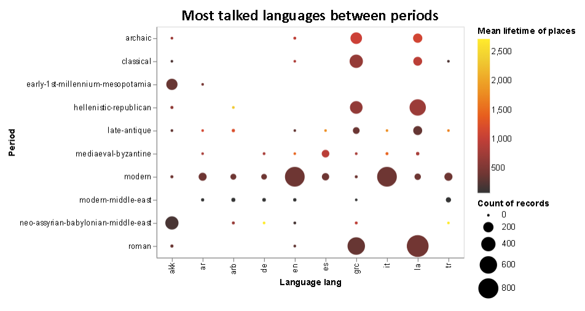
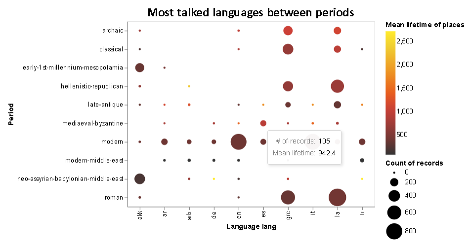

{(aim|}
This visualization shows the count of top 10 languages that they spoke in top 10 periods of the dataset colored with the lifetime of the places groub by these periods and languages.
{|aim)}

{(vistype|}
For these visualizations we used **scatter plot**
{|vistype)}

# Data Preparation

```python
import altair as alt
import vega_datasets as data
import pandas as pd
import numpy as np

names = pd.read_csv('pleiades-names.csv')

alt.data_transformers.disable_max_rows()

#Data preparation: Match each period with the type based on order they are inserted
names = names[['nameLanguage','minDate','maxDate','timePeriodsKeys']]

#Remove locations that with missing information, either from timePeriodsKeys or featureType
names['timePeriodsKeys'] = names['timePeriodsKeys'].str.replace(' ','')
names.dropna(subset=['nameLanguage','minDate','maxDate','timePeriodsKeys'],inplace=True)
names['timePeriodsKeys'] = names['timePeriodsKeys'].str.split(',').str[0]
names.reset_index(inplace=True)
names.drop(columns=['index'],inplace=True)

#Find the 10 periods that occur more often in the dataset
top10Periods = names['timePeriodsKeys'].value_counts().keys()[0:10]

#Find the 10 names that occur more often in the dataset
top10Lang = names['nameLanguage'].value_counts().keys()[0:10]

#Filter the dataset based on the top 7 periods and types
names = names[names['timePeriodsKeys'].isin(top10Periods)]
names = names[names['nameLanguage'].isin(top10Lang)]
names['lifetime'] = names['maxDate'] - names['minDate']
```
## Top languages among the top periods

In the following visualization we can see what language was the most spoken in every period based on the language were spoken in each place but also the lifetime of those places.

```python
alt.Chart(names).mark_circle().encode(
    x=alt.X('nameLanguage:N',title="Language lang"),
    y=alt.Y('timePeriodsKeys:N',title="Period"),
    size=alt.Size('count():Q',scale=alt.Scale(range=[10,800]),title="Count of records"),
    color=alt.Color('mean_lifetime:Q',scale=alt.Scale(scheme="darkred"),title="Mean lifetime of places"),
    tooltip=[alt.Tooltip('count()',title="# of records"),alt.Tooltip('mean_lifetime:Q',title="Mean lifetime")]
).transform_joinaggregate(
    mean_lifetime= 'mean(lifetime)',
    groupby=['nameLanguage','timePeriodsKeys']
).properties(
    title="Most talked languages between periods",
    width=400,
    height=300).configure_title(
    fontSize=20,
    font='Calibri',
    anchor='middle',
    color='black'
)
```




{(vismapping|}

 |           |Languages between Periods|
 |:---------:|:-----------------------:|
 |**x**      |lang of the language     |
 |**y**      |period categories        |
 |**color**  |mean lifetime of places  |
 |**size**   |count of places          |
 |**tootip1**|count of places          |
 |**tootip2**|mean lifetime of places  |

{|vismapping)}

{(dataprep|}
I firstly extract only the columns of the dataset that I will use. Using `minDate` and `maxDate` we calculate the `lifetime` of each place. Then I aggregate the data on `nameLanguage` and `timePeriodsKeys` and found the mean of the lifetimes of places in each categoty.
{|dataprep)}

{(limitations|}
From this scatter plot we cannot distinguish the exact correlation between languages and periods.
{|limitations)}

